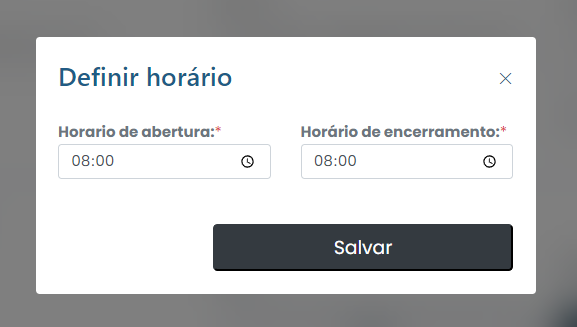

# Definir horario

## Como definir um cronograma?&#x20;

Para definir um horário, basta clicar na guia Definir horários no menu.

<figure><figcaption></figcaption></figure>

Depois, configure as informações necessárias e clique em "Salvar". Salve as mudanças e confirme o horário.
