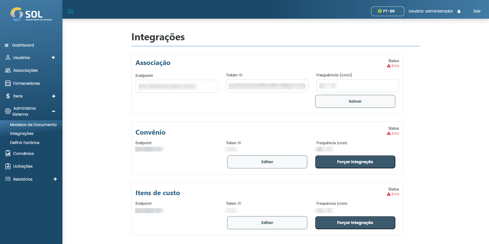

# Integração

Na aba "Integração", acessível através do menu principal no topo da página, você pode ver uma lista com todas as Integrações no Sistema, editar suas informações e forçar a integração.

O SOL verifica as informações do sistema que foi integrado e atualiza na base de dados as informações de Associação, Convênio e Itens de Custo.

<figure><figcaption></figcaption></figure>

## Como editar uma integração?&#x20;

Para editar uma integração, basta clicar na edição disponível ao lado do nome da integração na lista da aba "Integrações".

<figure><figcaption></figcaption></figure>

Em seguida, faça as alterações necessárias utilizando os endpoints e tokens validos, então clique em "Salvar". As alterações serão salvas e a integração será atualizada.

## Como forçar a integração?

Para forçar uma integração, você deve primeiro editar a integração utilizando os os endpoints e tokens necessarios e então clicar em forçar integração, assim, o status será alterado para "Em andamento".
