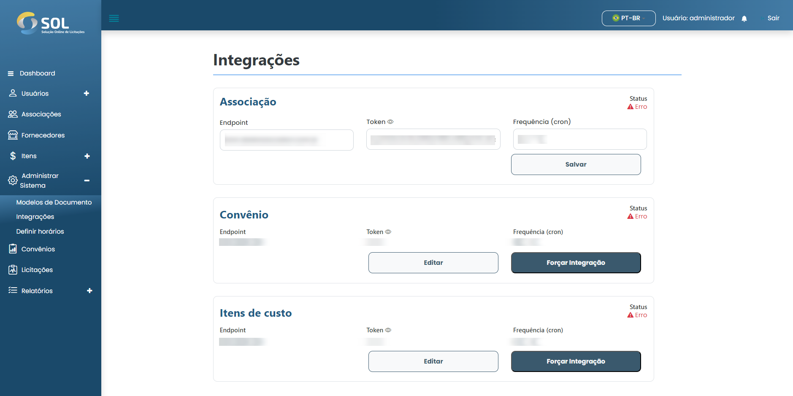

# Editar integração

## Como editar uma integração?&#x20;

Para editar uma integração, basta clicar na edição disponível ao lado do nome da integração na lista da aba "Integrações".

<figure><figcaption></figcaption></figure>

Em seguida, faça as alterações necessárias e clique em "Salvar". As alterações serão salvas e a integração será atualizada.
