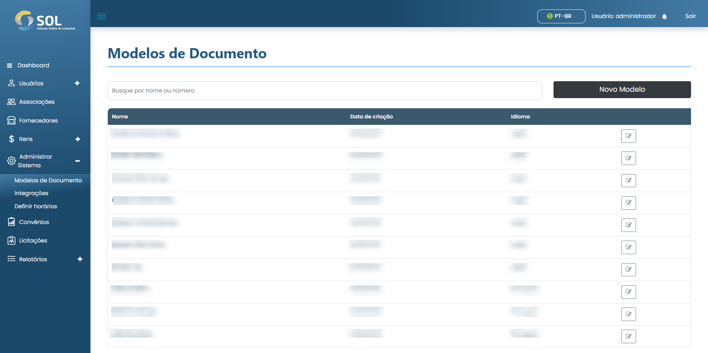

# Modelo de documentos

Na aba “Modelos de documento”, acessível através do menu principal no topo da página, é possível visualizar uma lista com todos os modelos de documentos cadastrados no Sistema, editar suas informações.

<figure><figcaption></figcaption></figure>
