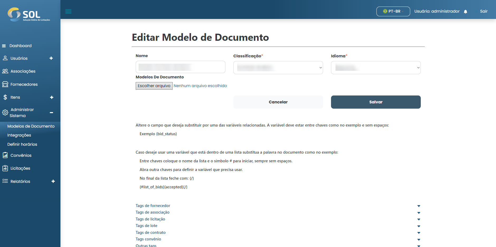

# Atualizar modelo

## Como atualizar modelo?

Para editar as informações de um modelo cadastrado, basta clicar no ícone de edição (lápis) disponível ao lado do nome dos modelos na lista da aba "modelos".

<figure><figcaption></figcaption></figure>

Em seguida, faça as alterações necessárias e clique em "Salvar". As alterações serão salvas e o modelo será atualizado.
