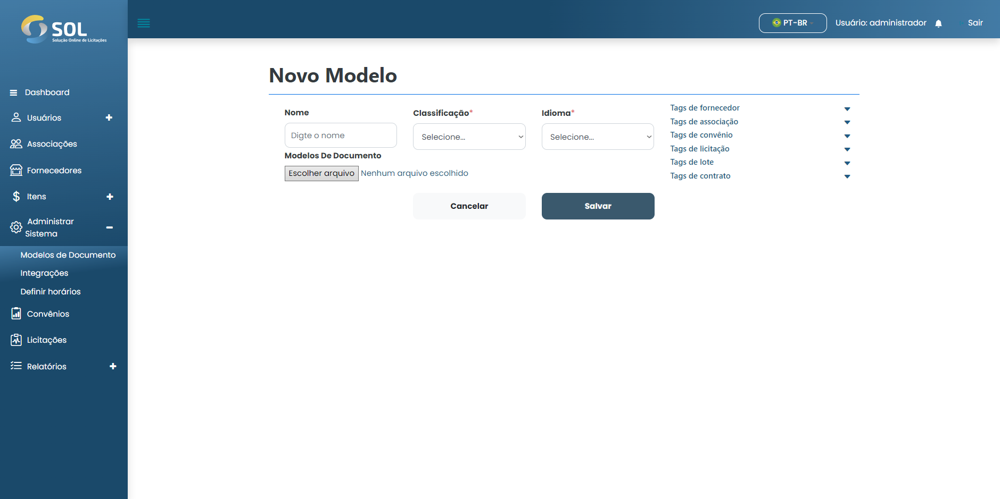

# Novo modelo

## Como adicionar um novo modelo?

Para adicionar um modelo ao Sistema, basta clicar no botão "Novo Modelo". Em seguida, preencha os campos obrigatórios.

<figure><figcaption></figcaption></figure>
