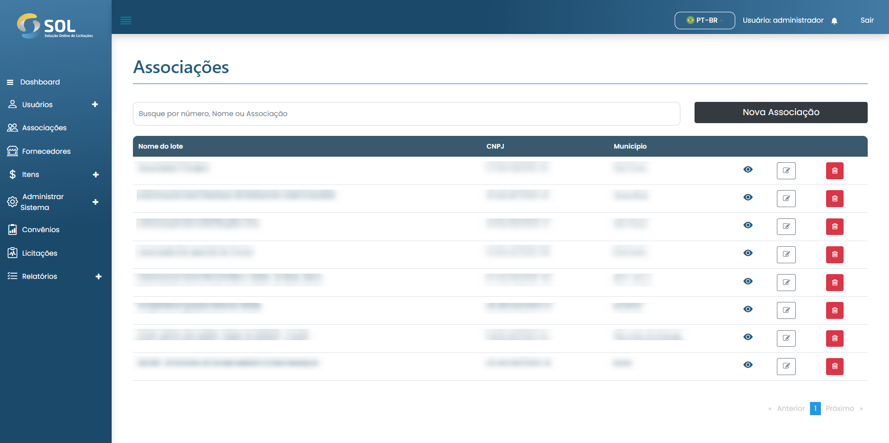
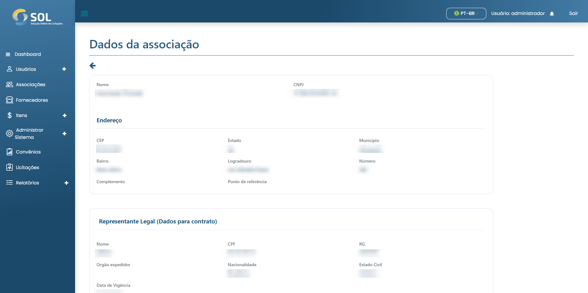

# Associações

Na aba "Associações", acessível através do menu principal no topo da página, você pode ver uma lista com todas as Associações cadastradas no Sistema, ver detalhes sobre elas, editar as informações, excluir uma Associação ou adicionar nova Associação.

<figure><figcaption></figcaption></figure>


Vale ressaltar que caso os dados de Associação tenham sido importados a partir de uma integração, não é possível editá-los, independente de qual seja seu Perfil de Administrador.


### Como ver os detalhes da associação?

Ao clicar sobre o nome de uma Associação, você tem acesso à página com os dados gerais dela, incluindo à quais convênios ela está ligada no momento e qual é o Revisor responsável por suas licitações e contratos.

<figure><figcaption></figcaption></figure>
