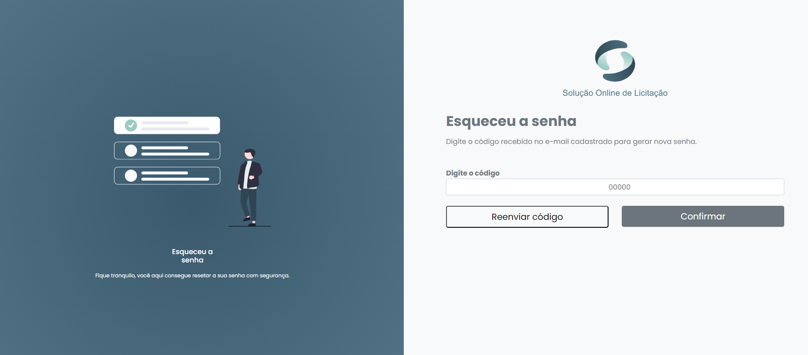

# Controle de acesso

## Entrar na plataforma

O usuário cadastrado acessa a plataforma com o  e-mail e  senha.  Apenas o administrador da pode cadastrar novos usuários.


Link:



<figure><figcaption></figcaption></figure>

## Esqueci a senha

Para recuperar o acesso clique na tela de Login em **`Esqueceu a senha?`**

Informe o e-mail cadastrado e clique em **`Continuar.`**

<figure><figcaption></figcaption></figure>

Você vai receber um código para validar o seu e-mail. Informe o código e clique em **`Continuar.`**

<figure><figcaption></figcaption></figure>

Com o código validado crie uma nova senha e confirme a nova senha. Clique em **`Continuar.`**

Pronto, agora você pode entrar com sua nova senha!

<figure><figcaption></figcaption></figure>
