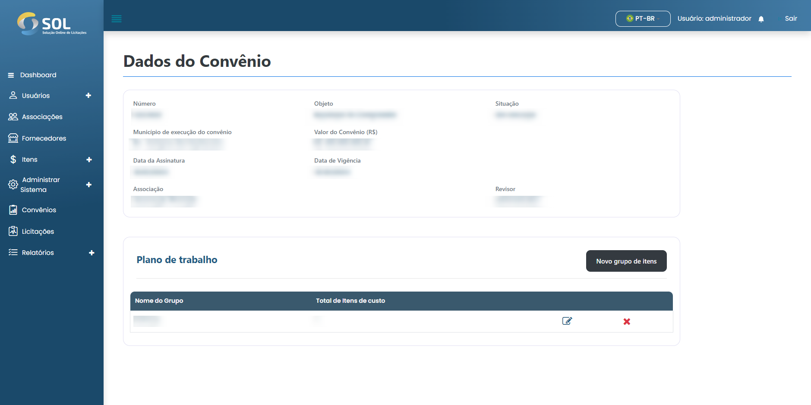

# Convênios

Na aba "Convênios", acessível através do menu principal no topo da página, você pode ver uma lista com todos os Convênios cadastrados no Sistema, ver detalhes sobre eles, editar as informações, excluir um Convênio ou adicionar um novo Convênio.


Vale ressaltar que caso os dados de Convênio tenham sido importados a partir de uma integração, não é possível editá-los, independente de qual seja seu Perfil de Administrador.


<figure><figcaption></figcaption></figure>

### Como ver os detalhes de um convênio?

Ao clicar sobre o nome de um Convênio, você tem acesso à página com os dados gerais.


O "Plano de trabalho" é onde os itens a serem adquiridos naquele Convênio devem ser especificados. Para acessar a página com esses itens, basta clicar no link do plano de trabalho.


<figure><figcaption></figcaption></figure>
