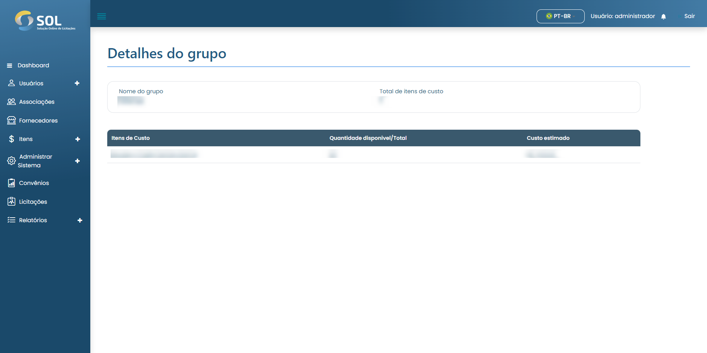

# Grupo de itens

Ao clicar sobre o nome de um Convênio, você tem acesso à página com os dados gerais.


O "Plano de trabalho" é onde os itens a serem adquiridos naquele Convênio devem ser especificados. Para acessar a página com esses itens, basta clicar no link do plano de trabalho.


<figure><figcaption></figcaption></figure>

### Como ver os detalhes de um grupo?

Caso clique sobre um dos grupos listados, o Sistema abre uma tela com os dados daquele grupo.

<figure><figcaption></figcaption></figure>
