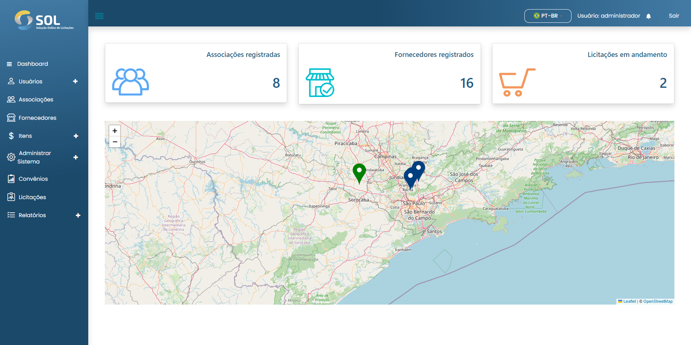

# Dashboard


Ao acessar a plataforma SOL, você é direcionado ao painel inicial do Sistema (Dashboard).


<figure><figcaption></figcaption></figure>

Nesta tela, você visualizará as abas disponíveis no menu principal:

* **Dashboard**
* **Usuários**
  * Associação
  * Fornecedores
  * Administração
* **Associações**
* **Fornecedores**
* **Itens**
  * Itens de custo
  * Produtos
  * Categorias
* Administrar Sistema
  * Modelos de Documento
  * Integrações
  * Definir horários
* **Convênios**
* **Licitações**
* **Relatórios** _(Em desenvolvimento)_
  * Licitações
  * Contratos
  * Relatórios gerais
  * Relatórios gerados

Ainda, você tem acesso ao seu perfil e às notificações do Sistema – representados pelos ícones de pessoa e de sino, respectivamente – além do mapa, com a indicação dos fornecedores com pontos na cor verde e das associações com pontos na cor azul. Acima do mapa, há três áreas, são elencados a quantidade de associações e de fornecedores cadastrados na plataforma e o número de licitações em andamento.

No mapa, é possível clicar nos fornecedores e associações cadastrados. Ao clicar no ponto de um Fornecedor, você é direcionado a uma nova tela com as suas respectivas informações.
