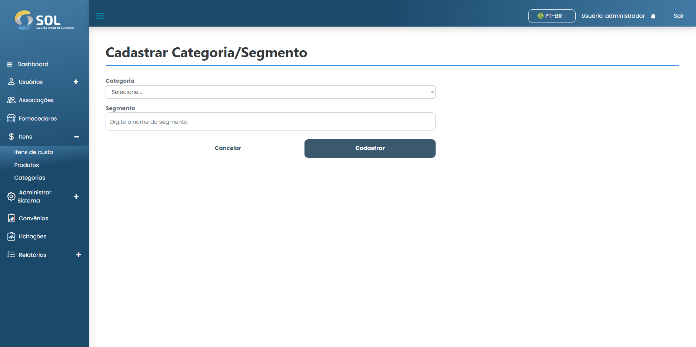

# Adicionar categoria

### Como adicionar uma nova categoria?

Para adicionar uma nova categoria ao Sistema, basta clicar no botão **`Nova categoria`**. Depois, basta preencher os campos solicitados.

<figure><figcaption></figcaption></figure>

Após preencher todos os campos, basta clicar em **`Cadastrar`**.
