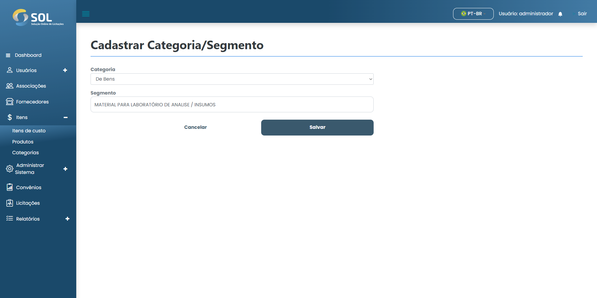

# Editar categoria

### Como editar uma categoria cadastrada?

Para editar informações de alguma categoria cadastrada, basta clicar no ícone de edição (lápis) disponível ao lado do nome da categoria na lista disponível.

<figure><figcaption></figcaption></figure>

Então, altere as informações que precisar e clique em **`Salvar`**. As alterações serão salvas e a categoria será atualizada.
