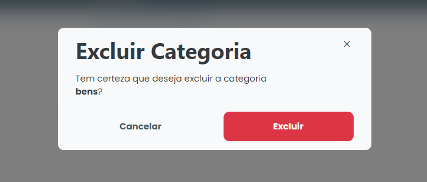

# Excluir categoria

### Como excluir uma categoria?

Para excluir alguma categoria cadastrada, basta clicar no ícone de exclusão (lixeira) disponível ao lado do nome da categoria na lista disponível na aba "Categoria".

<figure><figcaption></figcaption></figure>

Então, o sistema exibirá um modal de confirmação, basta clicar em **`Excluir`** e aquele item será removido do sistema.
