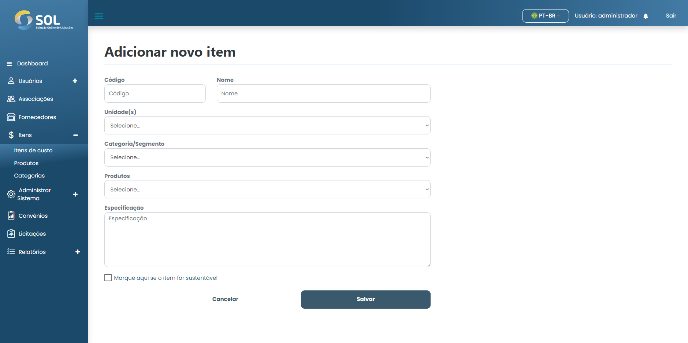

# Adicionar item

### Como adicionar um novo item de custo?

Para adicionar um novo item de custo ao Sistema, basta clicar no botão **`Novo item`**. Depois, basta preencher os campos solicitados.

<figure><figcaption></figcaption></figure>

Após preencher todos os campos, basta clicar em **`Criar item`**.
