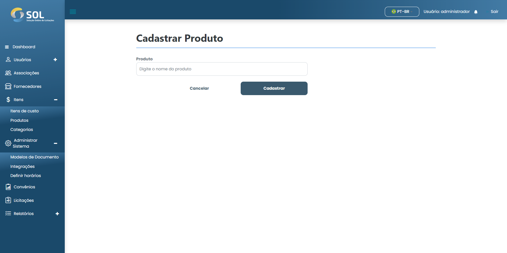

# Adicionar produto

### Como adicionar um novo produto?

Para adicionar um novo produto ao Sistema, basta clicar no botão **`Novo produto`**. Depois, basta preencher o campo solicitado.

<figure><figcaption></figcaption></figure>

Após preencher todos os campos, basta clicar em **`Cadastrar`**.
