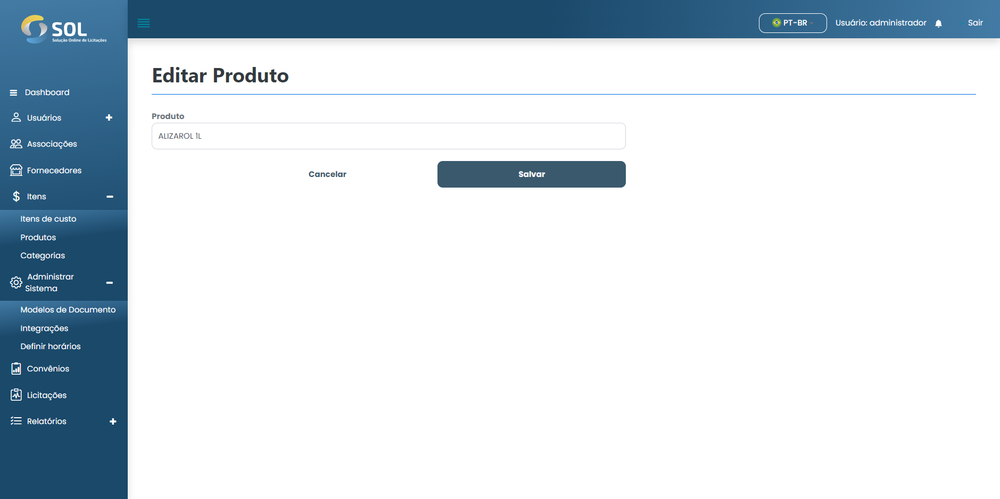

# Editar produto

### Como editar um produto?

Para editar informações de algum produto cadastrado, basta clicar no ícone de edição (lápis) disponível ao lado do nome do produto na lista disponível na aba "Produtos".

<figure><figcaption></figcaption></figure>

Então, altere as informações que precisar e clique em **`Salvar`**. As alterações serão salvas e o produto será atualizado.
