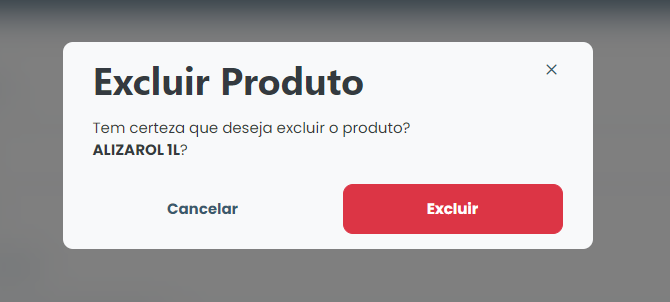

# Excluir produto

### Como excluir um produto?

Para excluir algum produto cadastrado, basta clicar no ícone de exclusão (lixeira) disponível ao lado do nome do produto na lista disponível na aba "Itens de Custo".

<figure><figcaption></figcaption></figure>

Então, o sistema exibirá um modal de confirmação, basta clicar em **`Excluir`** e aquele item será removido do sistema.
