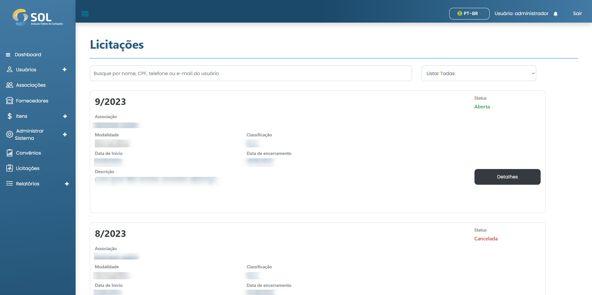
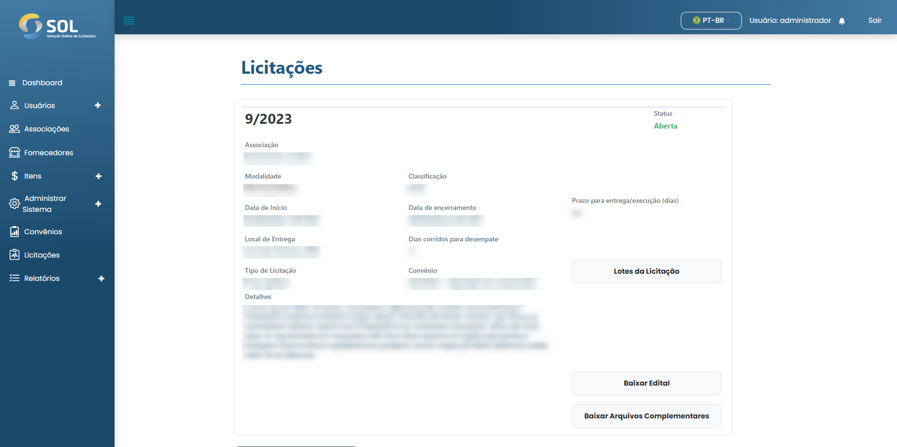

# Licitações

Na aba "Licitações", acessível através do menu principal no topo da página, você pode ver uma lista com todas as licitações cadastradas no Sistema, mesmo as já concluídas.

<figure><figcaption></figcaption></figure>

### Como ver os detalhes de uma licitação?

Para acessar informações completas sobre uma licitação, basta clicar no botão **`Detalhe`** disponível no quadro da licitação.


O Administrador tem permissão para executar ações como liberar a licitação e aprovar, ou recusar a escolha entre propostas feitas pela Associação. Via de regra, ele não executa nenhuma dessas ações, pois são funções do Revisor que ele designa para cada convênio. Por isso, no decorrer de todos os itens referentes a licitações, este manual irá se referir ao perfil Revisor.


<figure><figcaption></figcaption></figure>
