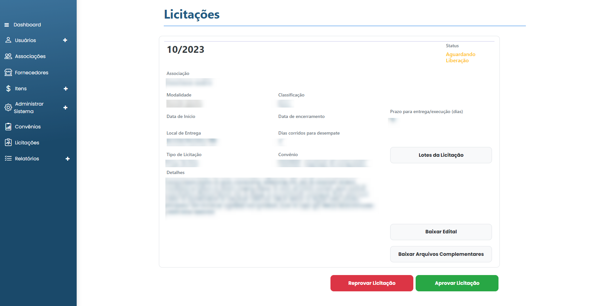

# Liberar/Recusar licitação

### Como Liberar ou recusar uma licitação?

Ao acessar os detalhes de uma licitação cujo o status seja "Aguardando liberação", você pode clicar em **`Liberar licitação`** ou **`Recusar licitação`**.

<figure><figcaption></figcaption></figure>

Caso você tenha escolhido recusar a licitação, você deverá preencher e descrever o motivo da recusa.

<figure><figcaption></figcaption></figure>

Após preencher a justificativa, basta clicar em **`Recusar licitação`**.
