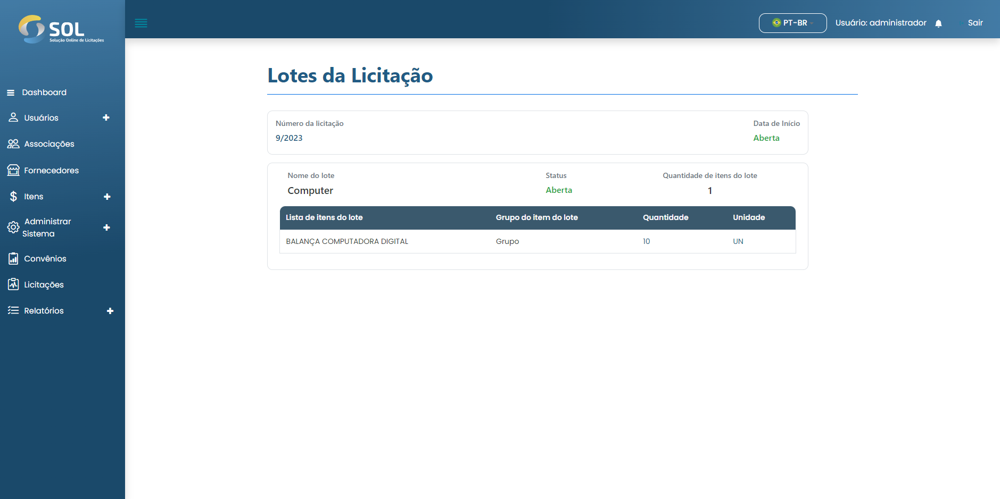

# Lotes da licitação

Para verificar quais itens estão sendo licitados e em qual quantidade, basta clicar em **`Lotes da Licitação`**. Uma página com as informações é aberta apenas para consulta e caso o lote já tenha recebido propostas de Fornecedores.

<figure><figcaption></figcaption></figure>

### Como visualizar as propostas feitas?

Você poderá clicar no botão **`Visualizar propostas`**. Uma lista com todas as propostas será exibida.


Ao clicar no botão **`Lista de propostas`**, disponível apenas para licitações de tipo "Preço Global", você tem acesso a todas as propostas recebidas naquela licitação.


Enquanto a licitação estiver aberta, não há ações possíveis para o Revisor. Quando a licitação se encerra a situação muda para "Em análise" e a Associação escolhe uma das propostas. Quando a escolha for feita, o Revisor receberá uma notificação.

Após isso, deve acessar a página da licitação novamente. Dessa vez, o Sistema mostrará qual é a melhor proposta (de menor valor) e qual foi escolhida pela Associação.
