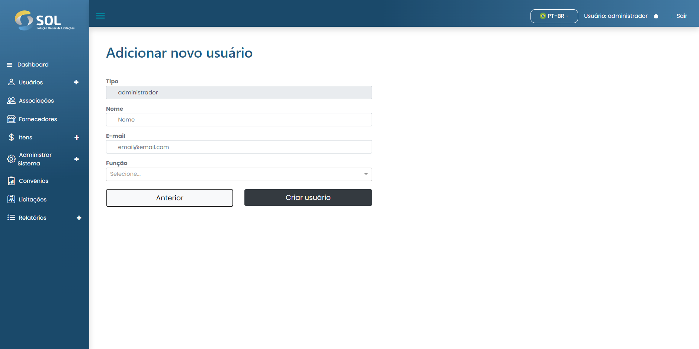

# Cadastrar usuário

### Como cadastrar um novo usuário?

Para adicionar um usuário de Associação, basta clicar no botão **`Novo usuário`** e preencher os campos existentes na página que será aberta em seguida.


No campo "Papel (tipo)" , você precisa selecionar qual será o tipo de perfil que o usuário terá, o que impacta nas permissões que o usuário terá dentro do sistema.


<figure><figcaption></figcaption></figure>

Após preencher todos os campos, basta clicar em **`Criar usuário`**.
