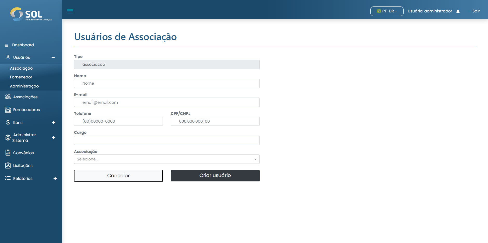

# Cadastrar usuário

### Como cadastrar um novo usuário?

Para adicionar um usuário de Associação, basta clicar no botão **`Novo usuário`** e preencher os campos existentes na página que será aberta em seguida.


No campo "Associação", você deve escrever ao menos as três primeiras letras do nome de uma Associação. Com isto, o Sistema exibirá uma lista com todas as associações que contêm aquelas letras. O mesmo processo deve ser repetido para preencher o campo "Cargo".


<figure><figcaption></figcaption></figure>

Após preencher todos os campos, basta clicar em **`Criar usuário`**.
