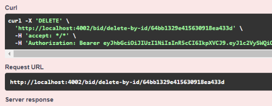
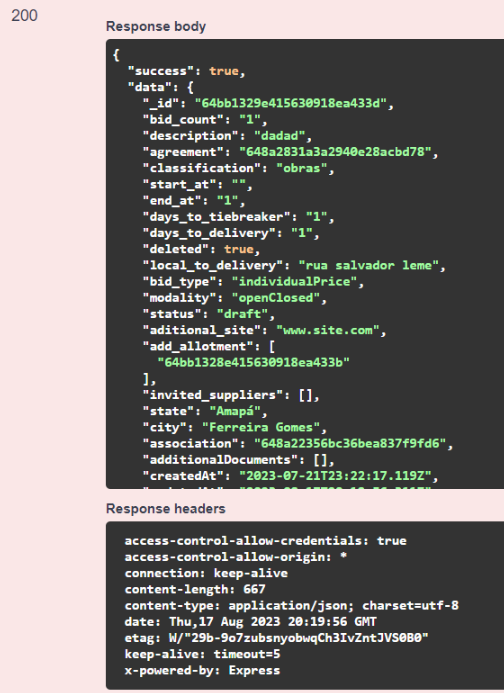

# DELETE BID/DELETE-BY-ID/{\_id}

## Método PUT adiciona propostas em uma licitação

Método **PUT** Adiciona propostas em uma licitação pelo seu id.

**Endereço SOL Produção:**&#x20;

**Requisição**

Obrigatório o ID da licitação

Parâmetros de requisição **BODY:**

<figure><figcaption></figcaption></figure>

**Retorno 200:**

<figure><figcaption></figcaption></figure>

