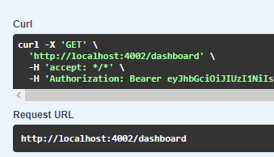

# GET /DASHBOARD

## Método GET para retornar as informações da Dashboard

Método **GET** para retornar as informações da dashboard.

**Endereço SOL Produção:**&#x20;

**Requisição**

<figure><figcaption></figcaption></figure>

**Retorno 200:**

<figure><figcaption></figcaption></figure>
