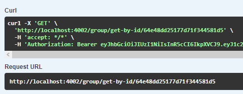
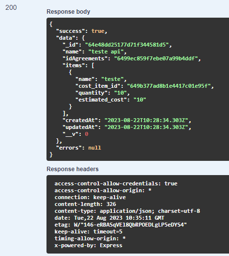

# GET /GROUP/GET-BY-ID/{\_id}

## Método GET para retornar as informações de um grupo

Método **GET** para retornar as informações do grupo passando o id do mesmo.

**Endereço SOL Produção:**&#x20;

**Requisição**

Obrigatório o ID do grupo

<figure><figcaption></figcaption></figure>

**Retorno 200:**

<figure><figcaption></figcaption></figure>

