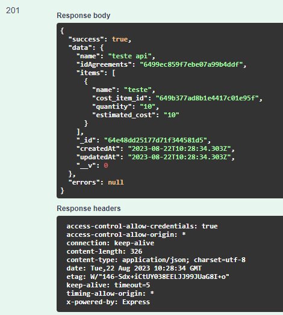

# POST /GROUP/REGISTER

## Método POST para registrar um novo grupo

Método **POST** para registrar um novo grupo utilizando o SOL

**Endereço SOL Produção:**&#x20;

Parâmetros de requisição **BODY**:

```
{
  "name": "string",
  "idAgreements": "string",
  "items": {
    "name": "string",
    "cost_item_id": "string",
    "quantity": "string",
    "estimated_cost": "string"
  }
}
```

**Retorno 201:**

<figure><figcaption></figcaption></figure>

