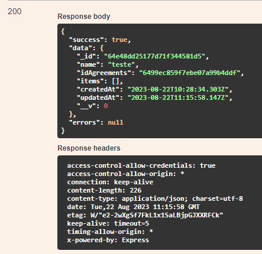

# PUT /GROUP/UPDATE/REMOVE-ITEM/{\_id}

## Método PUT para remover os itens do grupo

Método **PUT** para remover os itens do grupo pelo id do mesmo.

**Endereço SOL Produção:**&#x20;

**Requisição**

Obrigatório o ID do grupo

Parâmetros de requisição **BODY:**

```
{
  "name": "string",
  "cost_item_id": "string",
  "quantity": "string",
  "estimated_cost": "string"
}
```

**Retorno 200:**

<figure><figcaption></figcaption></figure>

