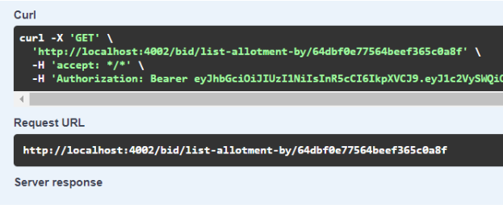

# PUT /ALLOTMENT/ADD-ITEM/{\_id}

## Método PUT para adicionar itens a um lote

Método **PUT** para adicionar itens a um lote através do ID do mesmo.

**Endereço SOL Produção:**&#x20;

**Requisição**

**Requisição**

Obrigatório o ID do lote

Parâmetros de requisição **BODY:**

```
{
  "group": "string",
  "item": "string",
  "quantity": "string",
  "unitMeasure": "string",
  "specification": "string"
}
```

**Retorno 200:**

<figure><figcaption></figcaption></figure>
