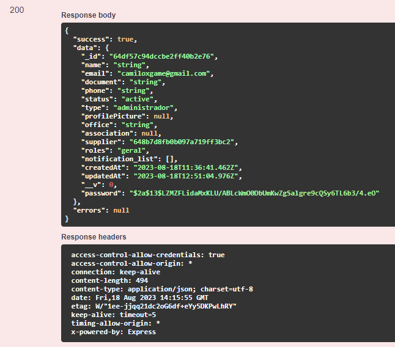

# DELETE /USER/DELETE-BY-ID/{\_id}

## Método DELETE para remover o usuário

Método **DELETE** para deletar o usuário pelo id do mesmo.

**Endereço SOL Produção:**&#x20;

**Requisição**

Obrigatório o ID do fornecedor

<figure><figcaption></figcaption></figure>

**Retorno 200:**

<figure><figcaption></figcaption></figure>

