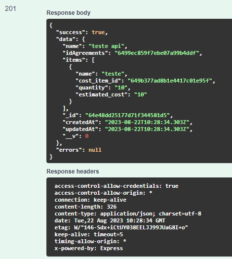

# GET /USER/ALL

## Método GET para retornar a lista de usuários

Método **GET** para retornar a lista de todos os usuários cadastrados.

**Endereço SOL Produção:**&#x20;

**Requisição**

<figure><figcaption></figcaption></figure>

**Retorno 200:**

<figure><figcaption></figcaption></figure>
