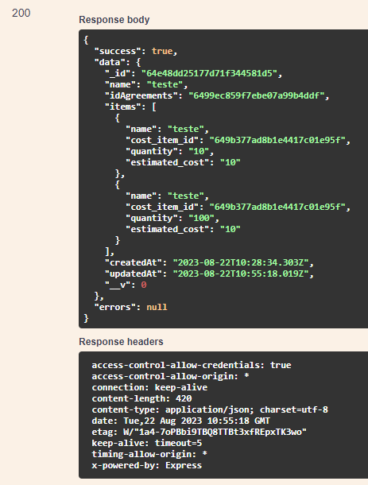

# GET /USER/GET-USERS-BY-SUPPLIER/{id}

## Método GET para retornar a lista de usuários de um determinado fornecedor

Método **GET** para retornar a lista de usuários de um determinado fornecedor através do ID do mesmo.

**Endereço SOL Produção:**&#x20;

**Requisição**

Obrigatório o ID do fornecedor

<figure><figcaption></figcaption></figure>

**Retorno 200:**

<figure><figcaption></figcaption></figure>

