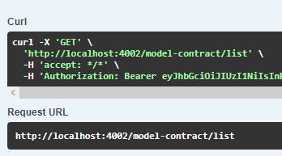

# POST /USER/CONFIRM-REGISTRATION-CODE

## Método POST para confirmar o registro do usuário

Método **POST** para confirmar o registro do usuário através do código de autenticação recebido no email.

**Endereço SOL Produção:**&#x20;

Parâmetros de requisição **BODY**:

```
{
  "email": "string",
  "code": 0
}
```

**Retorno 201:**

<figure><figcaption></figcaption></figure>

