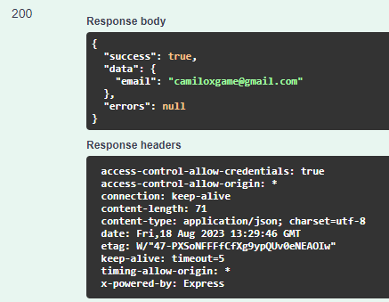

# POST /USER/FIRST-ACCESS

## Método POST para executar o primeiro acesso do usuário.

Método **POST** para executar o primeiro acesso do usuário.

**Endereço SOL Produção:**&#x20;

Parâmetros de requisição **BODY**:

```
{
  "email": "string"
}
```

**Retorno 200:**

<figure><figcaption></figcaption></figure>

