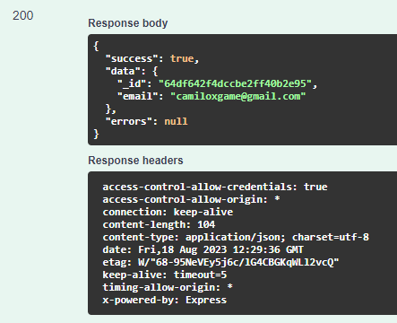

# POST /USER/RESEND-CODE-REGISTER-EMAIL

## Método POST para reenviar o código de registro de usuário.

Método **POST** para reenviar o código de confirmação de registro de usuário

**Endereço SOL Produção:**&#x20;

Parâmetros de requisição **BODY**:

```
{
  "email": "string"
}
```

**Retorno 200:**

<figure><figcaption></figcaption></figure>

