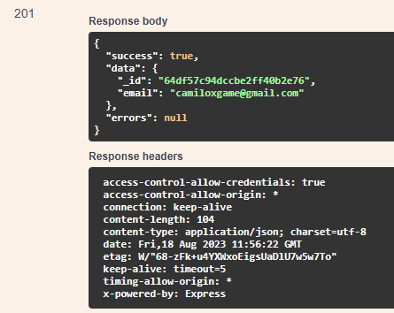

# PUT /USER/REGISTER-PASSWORD

## Método PUT para atualizar o fornecedor

Método **PUT** para atualizar o fornecedor pelo id do mesmo.

**Endereço SOL Produção:**&#x20;

**Requisição**

Obrigatório o ID do fornecedor

Parâmetros de requisição **BODY:**

```
{
  "email": "string",
  "status": "active",
  "password": "string"
}
```

**Retorno 201:**

<figure><figcaption></figcaption></figure>

