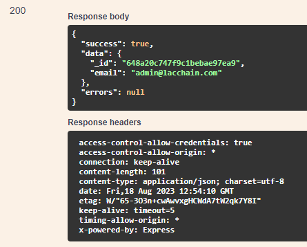

# PUT /USER/UDPATE-PASSWORD

## Método PUT para atualizar a senha do usuário autenticado

Método **PUT** para atualizar a senha do usuário autenticado

**Endereço SOL Produção:**&#x20;

**Requisição**

Parâmetros de requisição **BODY:**

```
{
  "password": "string",
  "newPassword": "string"
}
```

**Retorno 200:**

<figure><figcaption></figcaption></figure>

