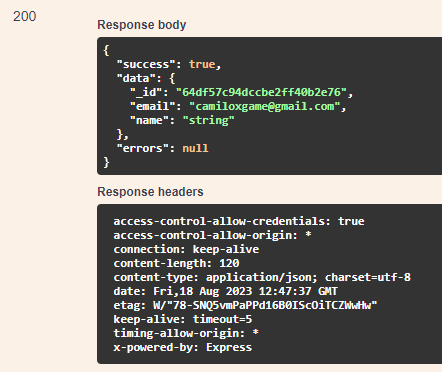

# PUT /USER/UPDATE/{\_id}

## Método PUT para atualizar o nome usuário

Método **PUT** para atualizar o nome do usuário pelo id do mesmo.

**Endereço SOL Produção:**&#x20;

**Requisição**

Obrigatório o ID do usuário

Parâmetros de requisição **BODY:**

```
{
  "name": "string"
}
```

**Retorno 200:**

<figure><figcaption></figcaption></figure>

