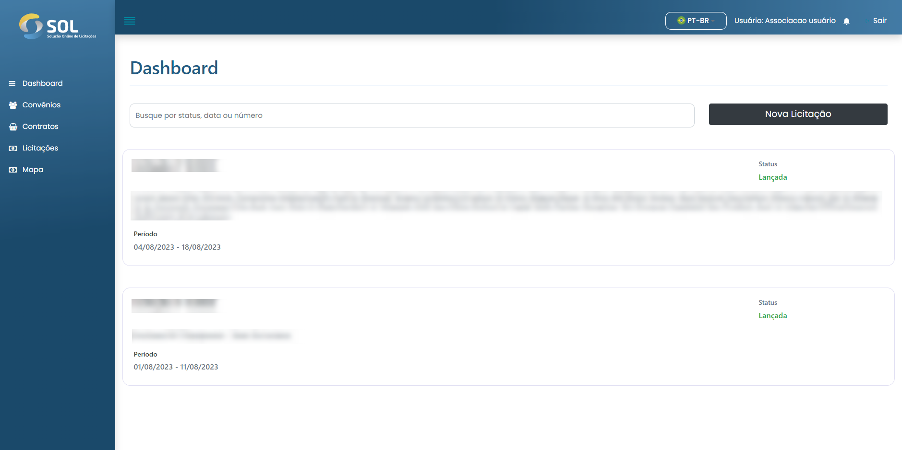

# Dashboard


Ao acessar a plataforma SOL, você é direcionado ao painel inicial do Sistema (Dashboard).


<figure><figcaption></figcaption></figure>

Nesta tela de início, você visualizará o panorama geral do seu perfil: suas informações pessoais e as últimas licitações abertas. Além disso, na página inicial é possível criar uma licitação clicando no botão **`Nova licitação`**.


Para cada licitação exibida, temos acesso às últimas dez licitações abertas e podemos visualizar as principais informações sobre os documentos. São elas:

* O titulo da licitação;
* A situação em que ela se encontra (status);
* Período de tempo em que ela permanecerá aberta.

Para visualizar todas as licitações, além das últimas, basta clicar no botão **Procurar licitações**.


Ainda, você tem acesso ao seu perfil e às notificações do Sistema – representados pelos ícones de pessoa e de sino, respectivamente.


#### Revisão da licitação

Após criar a licitação, o status muda para “Aguardando liberação”, como apresenta a imagem abaixo. Em seguida, o Revisor do Convênio irá conferir se os dados inseridos na licitação estão corretos, assim como as informações nos lotes e itens.



#### Licitação Liberada

Caso todos os dados da licitação estejam corretos, o Revisor irá liberá-la. Nesse instante, a licitação terá como situação “Liberada”. O perfil da Associação receberá uma notificação quando ocorrer a mudança de status.

Quando a licitação é liberada, o edital dela fica disponível para visualização e download. Para acessá-lo, basta clicar no botão "Baixar edital" disponível na mesma tela exibida acima.



#### Licitação aberta

Assim que chegar a data de início da licitação, definida pela Associação no momento de sua criação, a licitação mudará para a situação “Aberta”. Somente a partir da “Data de início”, os fornecedores poderão enviar propostas para a licitação.



#### Licitação Recusada

Caso alguma informação da licitação precise ser corrigida, o Revisor do convênio irá recusá-la. Sempre que isso ocorrer, ele deverá especificar o motivo da recusa. Automaticamente a situação da licitação retorna para ”Em rascunho” e uma mensagem  é exibida para a Associação.


A Associação sempre será notificada sobre as mudanças de situação das licitações criadas. As mudanças são apresentadas na aba “Notificações”, acessada pelo menu principal.
