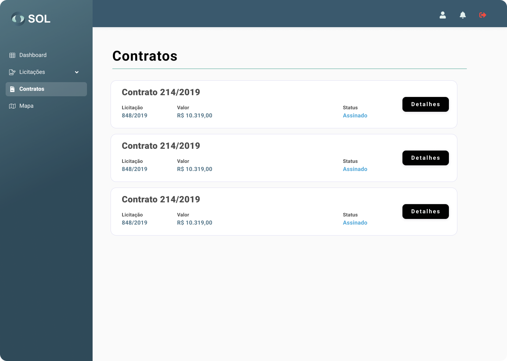

# Contratos

Caso você seja o Fornecedor vencedor da licitação, o Sistema irá gerar um contrato com as informações dos itens, quantidades e prazos que já constavam na licitação. Este contrato estará disponível na página "Contratos" que pode ser acessada através do menu principal do Sistema.

<figure><figcaption></figcaption></figure>

### Como ver os detalhes de um contrato?

Para conferir os detalhes do contrato ou assiná-lo, clique sobre ele.

<figure><figcaption></figcaption></figure>


Ao clicar em **`Proposta`**, irá abrir uma página que funciona como um link para a licitação que deu origem ao contrato e para a proposta enviada pelo Fornecedor.

