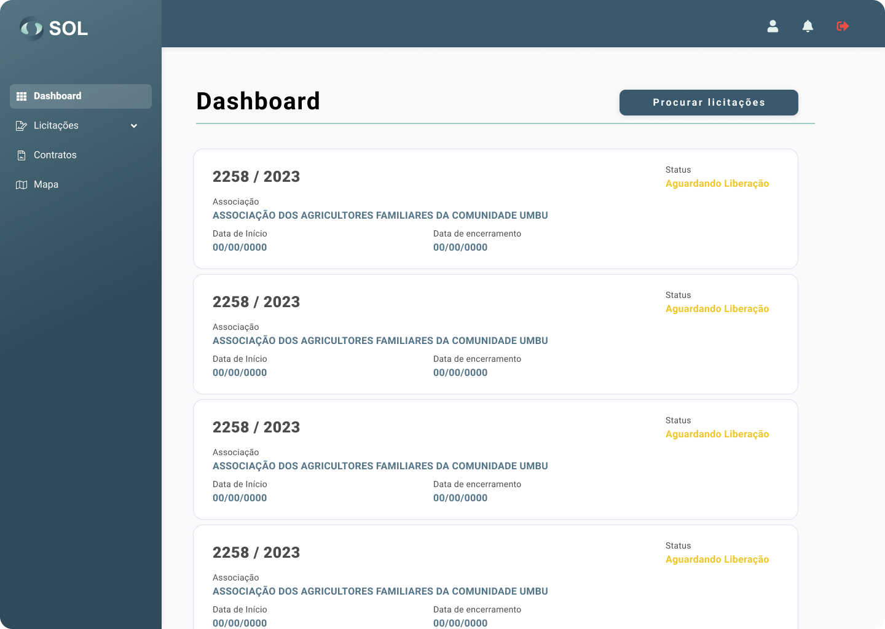

# Dashboard

<figure><figcaption></figcaption></figure>


Ao acessar a plataforma SOL, você é direcionado ao painel inicial do Sistema (Dashboard).


Nesta tela de início, você visualizará o panorama geral do seu perfil: suas informações pessoais e as últimas licitações abertas – que você está participando ou que pode participar.


Para cada licitação exibida, temos acesso às últimas dez licitações abertas e podemos visualizar as principais informações sobre os documentos. São elas:

* O titulo da licitação;
* A situação em que ela se encontra (status);
* Período de tempo em que ela permanecerá aberta.

Para visualizar todas as licitações, além das últimas, basta clicar no botão **Procurar licitações**.


Ainda, você tem acesso ao seu perfil e às notificações do Sistema – representados pelos ícones de pessoa e de sino, respectivamente.
