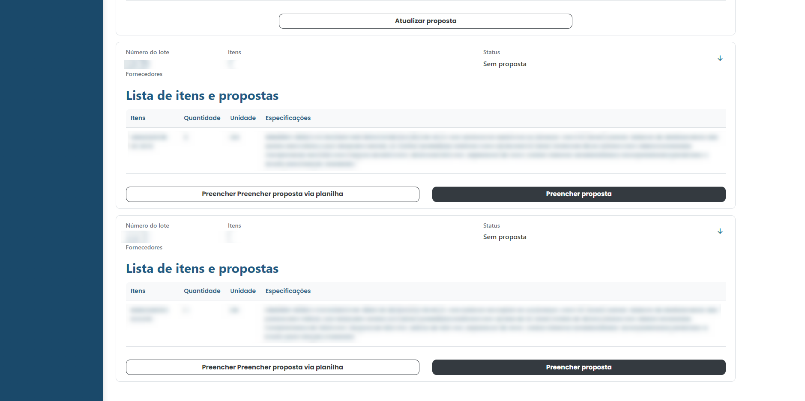
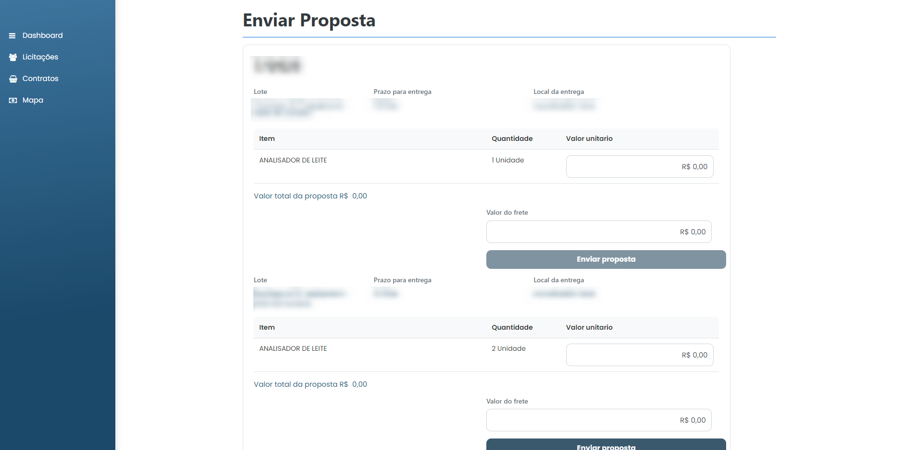
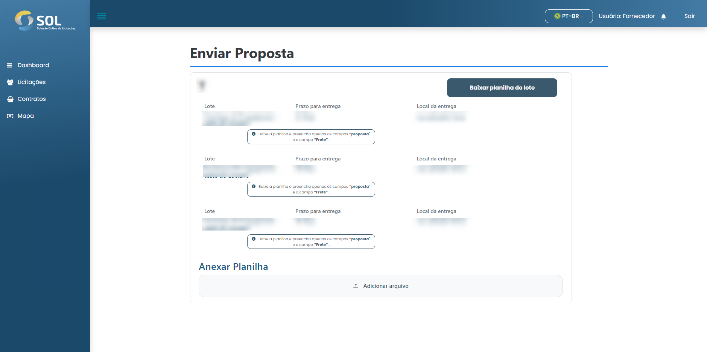

# Enviar proposta

### Como enviar uma proposta?

Na página "Lotes e itens", acessada pelo menu lateral. Quando você clica sobre o lote, os detalhes são expandidos, exibindo todos os itens cadastrados nele. Se a licitação for de tipo “Preço por item”, o único botão disponível nesta nova tela será o de **`Preencher proposta`**.

Caso ela seja de tipo “Preço por lote” ou “Preço global”, o botão **`Preencher proposta via planilha`** também será exibido e você deve optar por um dos métodos de preenchimento.

<figure><figcaption></figcaption></figure>

### Preencher Proposta Pelo Sistema

Se optar por preencher sua proposta diretamente no Sistema, basta clicar em **`Preencher proposta`**. Então o sistema abrirá a página "Enviar proposta", basta clicar em **`Clique para informar uma proposta`**. Isto feito, é aberta uma área para preenchimento da proposta onde você deverá informar o valor por unidade do item.

Então, basta preencher o campo "Valor do frete". Caso não haja cobrança de frete, é preciso preencher o campo com o número zero (0).

<figure><figcaption></figcaption></figure>

Com a proposta preenchida, basta clicar em **`Enviar proposta`**. Com isso feito, basta aguardar o prazo para encerramento da licitação. Você receberá uma notificação quando a Associação estiver analisando as propostas recebidas.

### Preencher Proposta Via Planilha

Em casos de licitação de tipo “Preço por lote” ou “Preço global”, você terá a opção de preencher a proposta por meio de uma planilha. Para isso, basta clicar no botão **`Preencher proposta via planilha`**.

Ao fazer isso, a tela “Preencher proposta” é exibida. Nela, você deve clicar no botão “Baixar planilha do lote”.


Ao fazer isso, o download de um arquivo no formato XLSX, que pode ser aberto com os softwares Excel, LibreOffice ou Numbers, é iniciado. Abra este arquivo para iniciar o preenchimento da proposta. A planilha baixada possui duas abas, uma chamada "proposta valor item" e outra chamada "proposta valor frete". Você deve preencher as células da coluna "proposta" na primeira aba e da coluna "frete (valor)" na segunda. Depois, basta salvar a alteração e fechar o arquivo.


Então, volte ao Sistema e clique no botão com a figura de clipes, no canto direito do campo “Planilha”, para anexar a o arquivo que você acabou de preencher.

<figure><figcaption></figcaption></figure>

Com isso feito, basta clicar em **`Enviar proposta`**. Em pouco tempo, o Sistema te enviará uma notificação informando se o processamento da planilha foi bem sucedido.
