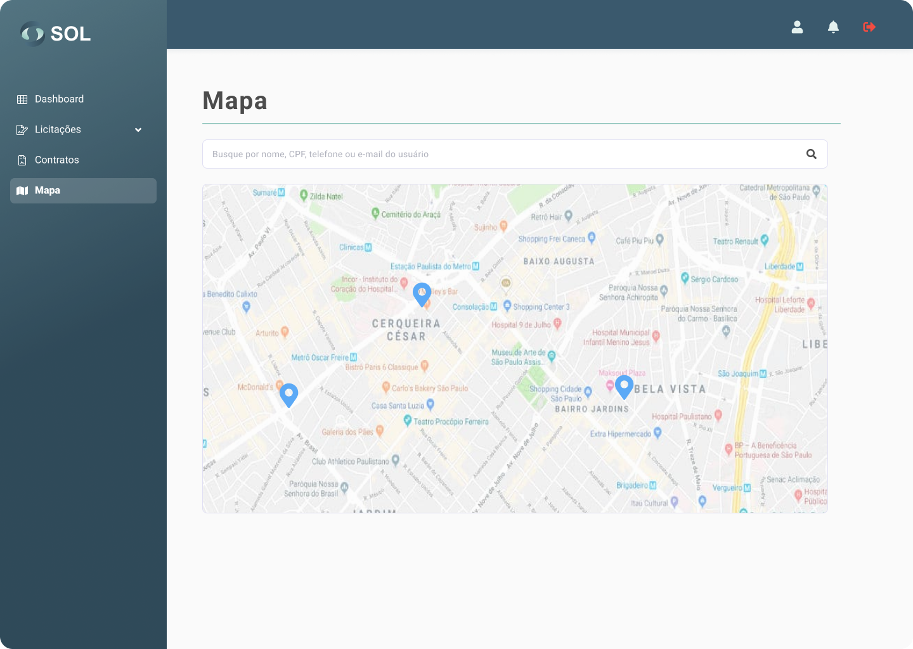

# Mapa

A tela "Mapas" pode ser acessada através de sua aba no menu principal do Sistema. Nela, estão indicadas as localidades das Associações cadastradas no Sistema (pontos em azul), além de sua própria localização (ponto em verde). Ao clicar sobre um deles, o nome é exibido.

<figure><figcaption></figcaption></figure>
