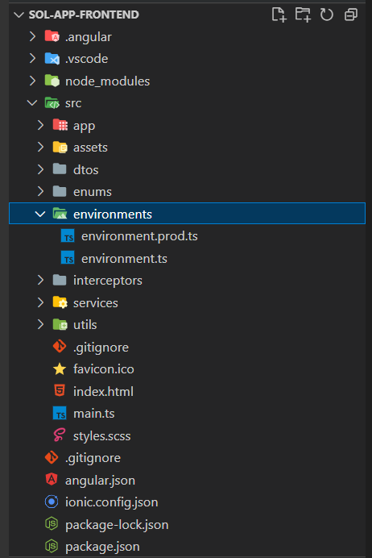

# Instalação do Frontend

### Preparando o ambiente

É necessário fazer a instalação de algumas ferramentas. Clique nos links abaixo para fazer a incitação de cada uma delas.

[](https://yarnpkg.com/cli/install)[](https://nodejs.org/en/)

### Configurando o arquivo do ambiente (.env)

No diretório `src/enviroments/` é necessário alterar o arquivo `enviroment.prod.ts.`

<figure><figcaption></figcaption></figure>

Alterar os parâmetros:

```
encrypt_key: a mesma utiliazada na API
api server e port
```

### Publicando o frontend com Nginx

Acesse o diretório raiz da API e execute o comando abaixo:

<pre><code><strong>λ ng build --c production
</strong></code></pre>

#### Configurar nginx

Você pode verificar o `nginx`que está instalado e funcionando com:

```
sudo systemctl restart nginx
sudo systemctl status nginx
```

#### CONFIGURAÇÃO DO NGINX

A configuração na seção anterior é tão simples quanto possível. Ele escutará na porta 80 HTTP qualquer nome de host que ainda não tenha sido interceptado. O ideal seria especificar um `server_name`, adicionar SSL, redirecionar HTTP para HTTPS.&#x20;

Você também pode considerar redirecionar não-www para www, adicionar cache ou incluir limitação de taxa.&#x20;

O Nginx pode fazer todas essas coisas.

```
# /etc/nginx/conf.d/mysife.conf

server {
  listen 0.0.0.0:80;
  root /srv/mysite;
  location / {
    try_files $uri $uri/ /index.html;
  }
}
```
